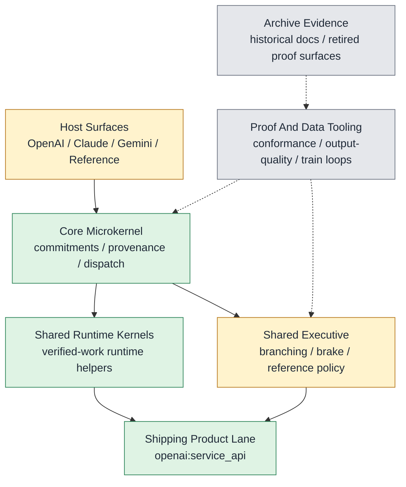

# CORTEX Status

Surface: product

_Generated from `internal/truth/cortex_status.json`. Edit the registry, then run `python3 internal/truth/generate_status.py`._

## Resting State

- Branch: `main`
- Rule: Clean synced main is the only resting state; the richer Cortex executive remains the product goal, and archive or lab surfaces do not define live product truth.

## Bootstrap

- `AGENTS.md`
- `docs/CORTEX_STATUS.md`
- `git branch --show-current`
- `git status --short --untracked-files=all`

## Goal

**Rich Executive For AI**

Cortex should be a richer multi-host executive layer for AI work: lifecycle-first, verification-aware, continuity-preserving, and capable of bounded correction without collapsing into host-specific hacks.

Not product:
- `diagnostics`
- `train loops`
- `graders`
- `workflow ledgers`
- `governance records`

## Identity And Research Stance

Cortex is the installable executive layer that wraps a model or host surface and adds executive function to the underlying brain without redefining the brain itself as the product.

Research stance:
- Steal executive skills from systems that already work, especially human executive function, then translate them into small lawful operators, state, gates, and proof surfaces.
- Use first-principles reasoning and live evidence together: start from packet law, then challenge or revise that law explicitly when repeated runtime evidence disproves it.
- Prefer brilliant concrete code when it cleanly realizes the intended executive skill; do not preserve a worse abstraction just because it matched an earlier local framing.

Answering stance:
- When describing Cortex, start with the full executive denominator before narrowing to the current shipping subset.
- Always distinguish Cortex truth, shipping truth, conformance truth, and the current train.

## Executive Completion

- Current full-executive completion: `80%`
- Shippable threshold for the full executive: `85%`
- Gap to shippable full-executive read: `5` points
- Status mix: `6` landed, `1` partial, `1` north_star
- Scoring rule: `landed=100%`, `partial=30%`, `north_star=0%`
- This score measures progress toward the full executive denominator, not just the current shipping lane.

When user asks where Cortex is at:
- Start with the current executive completion percent versus the shippable threshold.
- Then summarize the bio-to-code matrix by landed, partial, and north_star rows.
- Then name the next highest-leverage rows to raise the score without drifting from Cortex law.

Fastest route to raise the score next:
- `Multi-host executive continuity`: `+11` points if landed. Largest remaining near-term executive lift now that the richer OpenAI-first law is landed and proven on the shipping lane.

## Bio-To-Code Matrix

| Executive Skill | What We Are Stealing | Status | Weight | Code Homes | Proof Surfaces | Next Move |
| --- | --- | --- | --- | --- | --- | --- |
| Truth-preserving commitments and bounded certification | Truth maintenance and reality binding | `landed` | `12` | `cortex/core`, `cortex/drivers` | `tests/product`, `tests/conformance` | Keep this foundation stable while richer executive control builds on top. |
| Bounded correction and verified-work preservation | Error repair without losing the main task thread | `landed` | `15` | `cortex/runtime`, `cortex/sre`, `cortex/hosts/openai` | `tests/product` | Keep preservation-state repair stable while the remaining cross-host coherence work closes over the same executive law. |
| Uncertainty handling and brake | Hesitation and uncertainty-aware inhibition | `landed` | `13` | `cortex/sre` | `tests/product`, `tests/experimental` | Keep reference-derived brake and uncertainty control stable while cross-host coherence is re-earned. |
| Branch continuity, suspend/resume, and truthful closure | Working memory across interruptions plus truthful closure | `landed` | `15` | `cortex/sre`, `cortex/hosts/openai` | `tests/product`, `tests/conformance` | Keep suspend/resume and truthful closure stable while donor-host coherence is re-earned. |
| Intervention pricing versus neutrality | Deciding when to intervene, stay neutral, or stop | `landed` | `10` | `cortex/sre` | `tests/product`, `tests/experimental` | Keep reference-governed intervention pricing stable while remaining host realizations re-earn coherence. |
| Blocker surfacing and goal-debt management | Noticing unresolved blockers and unfinished intentions | `landed` | `10` | `cortex/sre`, `cortex/hosts/openai` | `tests/product` | Keep closure-required and blocker-debt surfacing stable while cross-host continuity is re-earned. |
| Multi-host executive continuity | One executive across different brains and contexts | `partial` | `15` | `cortex/hosts/openai`, `cortex/hosts/claude`, `cortex/hosts/gemini`, `cortex/hosts/reference` | `tests/product`, `tests/conformance` | Raise Claude and Gemini conformance while keeping one Cortex law across all hosts. |
| Offline consolidation and support geometry | Sleep-like consolidation and support systems | `north_star` | `10` | _planned only_ | _planned only_ | Keep this out of the shipped lane until support geometry earns a lawful product shape. |

## Math To Code Rules

- Every load-bearing executive skill must land as explicit law, typed code, and at least one proof surface.
- Every packet-level mathematical object should map to exactly one typed code object or operator family with one owning module.
- Every typed load-bearing code object should have one clear home and one explicit test or proof surface.
- Forbidden leaks across Core, SRE, AUX, host wiring, and lab proof surfaces must be explicit.
- Law revision rule: The current math is binding landing law until live evidence disproves or narrows it. When that happens, revise the law explicitly and update the code and proof surfaces in the same seam; do not silently patch around stale math in implementation.

## System Map

## Subsystems

| Subsystem | Status | Code Homes | Note |
| --- | --- | --- | --- |
| Core Microkernel | `green` | `cortex/core`, `cortex/drivers` | Active product law for commitments, provenance, dispatch, and host binding. |
| Shared Runtime Kernels | `green` | `cortex/runtime` | Only shared runtime kernels belong here. |
| Shared Executive | `yellow` | `cortex/sre` | Richer shared executive is active Cortex code; mediation remains experimental/off-by-default even though it lives beside the active SRE family. |
| Host Realizations | `yellow` | `cortex/hosts/openai`, `cortex/hosts/claude`, `cortex/hosts/gemini`, `cortex/hosts/reference` | Host-native shells are part of Cortex reality; shipping truth stays OpenAI-first while Claude, Gemini, and reference remain explicit conformance surfaces. |
| Proof And Data Tooling | `gray` | `lab`, `lab/eval`, `tools` | Proof, evaluation, and maintainer tooling. Useful for falsification, not product truth. |

## Packet To Code

| Packet | Responsibility | Code Homes | Proof Surfaces |
| --- | --- | --- | --- |
| `Core` | Lifecycle-first dispatch, commitment extraction, provenance, certification, and bounded environment access. | `cortex/core`, `cortex/drivers` | `tests/product`, `tests/conformance` |
| `SRE` | Reference control policy, branching, brake, uncertainty, verified-work preservation, and reference scoring. | `cortex/sre` | `tests/product`, `tests/experimental` |
| `Host Wiring` | Host-native runtime shells and transport/service bindings for OpenAI, Claude, Gemini, and reference. | `cortex/hosts/openai`, `cortex/hosts/claude`, `cortex/hosts/gemini`, `cortex/hosts/reference` | `tests/product`, `tests/conformance` |
| `Lab Proof` | Conformance runners, output-quality tooling, and train-loop evidence used to falsify or prove product seams. | `lab`, `lab/eval` | `tests/lab`, `tests/internal` |

## Hosts

| Host | Shipping | Conformance | Strongest Surface | Daily Iteration | Code Home |
| --- | --- | --- | --- | --- | --- |
| `openai` | `default` | `conformant` | `service_api` | `operator_cli` | `cortex/hosts/openai` |
| `claude` | `non-default` | `partial` | `operator_cli` | `operator_cli` | `cortex/hosts/claude` |
| `gemini` | `non-default` | `partial` | `operator_cli` | `operator_cli` | `cortex/hosts/gemini` |
| `reference` | `non-product` | `conformant` | `reference_cli` | `reference_cli` | `cortex/hosts/reference` |

## Shipping And Conformance Truth

- Shipping default: `openai:service_api`
- Accepted conformance next decision: `promote`

## Closure Gates

| Gate | Status | Note |
| --- | --- | --- |
| `main_synced` | `passed` | Resting truth is enforced through clean synced main and the workflow helper. |
| `cleanup_report` | `passed` | cleanup-report is the strict final hygiene gate for the resting repo state. |
| `single_truth` | `passed` | The status registry and generated status doc are the only live operational truth surfaces. |
| `legacy_test_buckets_removed` | `passed` | tests/unit and tests/integration are retired in favor of purpose-first active buckets. |

## Next Product Train

- Train: `multi-host-executive-continuity`
- Surface: `product`
- Executive benefit: Raise Claude, Gemini, and reference coherence around the now-landed richer executive law while keeping shipping truth OpenAI-first.
- Why now: The OpenAI-first executive is now shipped and proven enough that the largest remaining lift is multi-host continuity rather than more OpenAI-only behavior work.
- Primary metric: `coherent cross-host conformance on continuity, brake, intervention pricing, and closure truth`
- Guardrail: `no host-specific policy forks and no widening of shipping truth away from openai:service_api`
- Kill rule: `cut any wiring-only divergence into a separate seam instead of revising Cortex law prematurely`

## Where To Work Next

- Start with multi-host executive continuity around the now-landed OpenAI-first executive law.
- Keep tri-brain conformance explicit while shipping truth stays OpenAI-first.
- Use lab proof surfaces only to falsify or prove host-realization seams; do not widen status truth from non-shipping reruns alone.

## Canonical Proof

**Default**

- `make product-test`
- `make conformance-test`
- `make experimental-test`
- `make -C internal test`
- `make lab-test`

**Status**

- `python3 internal/truth/generate_status.py --check`
- `python3 internal/archive/generate_archive_index.py --check`

**Workflow**

- `python3 internal/workflow/repo_workflow.py sync-main`
- `python3 internal/workflow/repo_workflow.py start-session --agent codex --slug task-name`
- `python3 internal/workflow/repo_workflow.py close-session --message "scope: end-state summary"`
- `python3 internal/workflow/repo_workflow.py cleanup-report`

## Retained Data

- `conformance` at `.cortex/live_validation/conformance` keeps `accepted_baseline`, `current_candidate`, `latest`
  Policy: Timestamped runs are generated evidence only; manifests and summaries outrank raw timestamp directories.
- `train_loops` at `.cortex/train_loops` keeps `accepted_baseline`, `current_candidate`, `latest`
  Policy: Compact summaries are the maintained view; old train narratives are archival.

## Retained Evidence Refs

- `E23 preservation-state evidence` -> `archive/e23-preservation-state-machine`
  Purpose: Preserved review evidence for the landed preservation-state kernel extract and later provenance checks.

## Blocked Moves

- Do not let archived docs or train notes act as live truth.
- Do not treat lab or evaluation output as product progress unless shipped runtime behavior changes.
- Do not hide Claude or Gemini behind backlog language when reporting conformance.
- Do not introduce host-specific policy forks to force donor coherence.

## Active Docs

- `docs/README.md`
- `docs/CORTEX_PRODUCT_CHARTER.md`
- `docs/CORTEX_PRODUCT_BOUNDARY.md`
- `docs/CORTEX_V2_CORE_2.md`
- `docs/CORTEX_V2_SRE_2.md`
- `docs/CORTEX_V2_AUX_2.md`
- `docs/CORTEX_STATUS.md`
- `docs/internal/REPO_WORKFLOW.md`

## Operational Focus

- Current tracked train: `multi-host-executive-continuity`
- Current focus note: Raise Claude, Gemini, and reference coherence around the now-landed OpenAI-first executive law without widening shipping truth or permitting host-specific policy forks.
