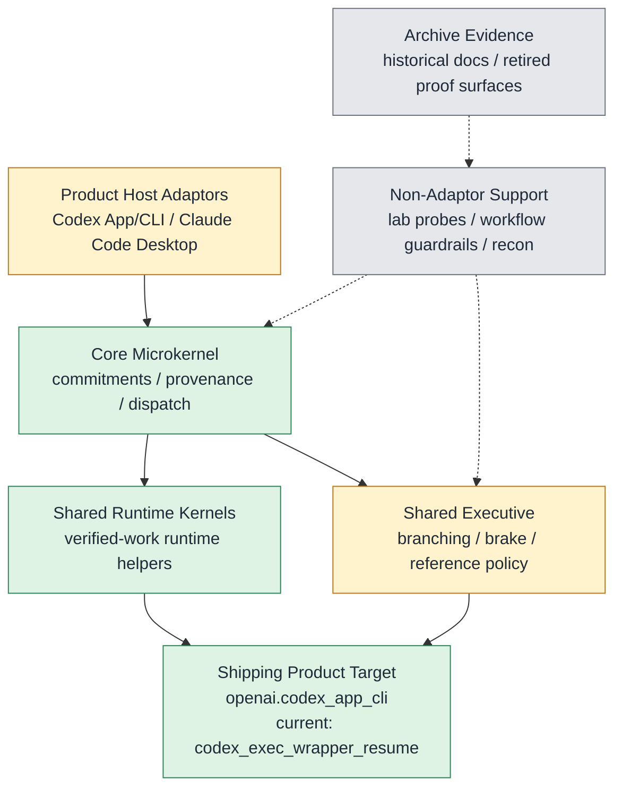

# CORTEX Status

Surface: product

_Generated from `internal/truth/cortex_status.json`. Edit the registry, then run `python3 internal/truth/generate_status.py`._

## Resting State

- Branch: `main`
- Rule: Clean synced main is the only resting state; the richer Cortex executive remains the product goal, and archive or lab surfaces do not define live product truth.

## Bootstrap

- `AGENTS.md`
- `docs/CORTEX.md`
- `docs/CORTEX_STATUS.md`
- `git branch --show-current`
- `git status --short --untracked-files=all`

## Goal

**Rich Executive For AI**

Cortex should be a richer multi-host executive layer for AI work: lifecycle-first, verification-aware, continuity-preserving, and capable of bounded correction without collapsing into host-specific hacks.

Not product:
- `diagnostics`
- `train loops`
- `graders`
- `workflow ledgers`
- `governance records`

## Identity And Research Stance

Cortex is the installable executive layer that wraps a model or host surface and adds executive function to the underlying brain without redefining the brain itself as the product.

Research stance:
- Steal executive skills from systems that already work, especially human executive function, then translate them into small lawful operators, state, gates, and proof surfaces.
- Use first-principles reasoning and live evidence together: start from packet law, then challenge or revise that law explicitly when repeated runtime evidence disproves it.
- Prefer brilliant concrete code when it cleanly realizes the intended executive skill; do not preserve a worse abstraction just because it matched an earlier local framing.

Answering stance:
- When describing Cortex, lead with shipping truth, conformance truth, the current train, and the active quality/risk focus. Surface the executive-completion denominator only on explicit denominator or progress-accounting questions.
- Always distinguish Cortex truth, shipping truth, conformance truth, and the current train.

## Cortex Orientation Capsule

_Generated orientation only; authority remains scoped to `docs/CORTEX.md`, the V2 packet docs, `internal/truth/cortex_status.json`, and code/proof surfaces._

Cortex is a post-training runtime executive-function layer around models and CLI hosts. It is not a plugin, translation layer, monitor, middleware pile, or post-training replacement.

Target loop: model/host event -> task-state and executive-risk understanding -> intervention decision -> control mode -> better next model behavior. Valid control modes include silence, route, degrade, block, preserve, recheck, ask, or grounded visible intervention when a model-integrable anchor exists.

Capability families: Truth-preserving commitments and bounded certification; Bounded correction and verified-work preservation; Uncertainty handling and brake; Branch continuity, suspend/resume, and truthful closure; Intervention pricing versus neutrality; Blocker surfacing and goal-debt management; Multi-host executive continuity; Offline consolidation and support geometry.

Subsystem boundaries: Core owns commitment/provenance/dispatch truth; SRE owns route, brake, expectation debt, goal debt, continuity, and policy pressure; AUX owns removable publication-only support priors; host adapters consume Core/SRE decisions in host-native I/O; lab, eval, recon, archive, and workflow surfaces prove or preserve evidence but are not product identity.

Grounding rule: any product claim, plan, or implementation seam must name identity/current truth, a code owner, a proof surface, and the model-I/O path. If the relevant code was not read, say so before taking a position.

Current train: `codex-app-cli-hook-native-behavior-comparison`. Next train: `codex-app-cli-hook-native-behavior-comparison-live-run`. Shipping default: `openai.codex_app_cli`. Keep Cortex truth, brain-wiring truth, conformance truth, shipping truth, and live behavior-lift claims separate; structural proof alone does not earn model-output lift.

## Live Product Truth

- Shipping default: `openai.codex_app_cli`
- Conformance truth: `openai=conformant`, `claude=conformant`, `gemini=conformant`, `reference=conformant`
- Accepted conformance next decision: `promote`

## Current Focus

- Current tracked train: `codex-app-cli-hook-native-behavior-comparison`
- Active quality/risk focus: The current focus added the Codex App/CLI hook-native behavior comparison harness and silent-arm hook-client suppression. Gate 0 passed: both arms used product lifecycle perception with no runtime snapshot, shared prompt hash, workspace seed hash, model, and task family, the hook-native arm emitted the exact locked Stop block, and the silent-only arm recorded the exact suppressed block diagnostics without model-visible stdout. This earns structural comparison readiness only, not live behavior lift; approved live trials remain the next product train.
- Next product train after the current focus: `codex-app-cli-hook-native-behavior-comparison-live-run`

## Bio-To-Code Matrix

| Executive Skill | What We Are Stealing | Status | Weight | Code Homes | Proof Surfaces | Next Move |
| --- | --- | --- | --- | --- | --- | --- |
| Truth-preserving commitments and bounded certification | Truth maintenance and reality binding | `landed` | `12` | `cortex/core`, `cortex/drivers` | `tests/product`, `tests/conformance` | Keep this foundation stable while richer executive control builds on top. |
| Bounded correction and verified-work preservation | Error repair without losing the main task thread | `landed` | `15` | `cortex/runtime`, `cortex/sre`, `cortex/hosts/openai` | `tests/product` | Keep preservation-state repair stable while support-side experiments stay removable and off the shipping critical path. |
| Uncertainty handling and brake | Hesitation and uncertainty-aware inhibition | `landed` | `13` | `cortex/sre` | `tests/product`, `tests/experimental` | Keep reference-derived brake and uncertainty control stable while AUX remains advisory and runtime-off-by-default. |
| Branch continuity, suspend/resume, and truthful closure | Working memory across interruptions plus truthful closure | `landed` | `15` | `cortex/sre`, `cortex/hosts/openai` | `tests/product`, `tests/conformance` | Keep suspend/resume and truthful closure stable now that host-local branch continuity is repaired across Claude, Gemini, and reference; branch-local continuity may reopen only from branch-linked cues, and any future support memory must remain explicit, optional, and non-binding. |
| Intervention pricing versus neutrality | Deciding when to intervene, stay neutral, or stop | `landed` | `10` | `cortex/sre`, `cortex/aux`, `cortex/runtime` | `tests/product`, `tests/experimental`, `tests/conformance` | Hold calibrated intervention pricing stable now that posture-sensitive online control is S-tier closed, anti-thrash is landed on the live runtime path, and brain-capability-aware routing is earned as a host-agnostic SRE mechanism: the executive carries an `OperatorBrainCapabilityEnvelope` (continuity_tolerance, verification_tolerance, output_contract_tolerance) that drives a bounded threshold ladder (NONE / DEGRADE / UNSUPPORTED at 0.20 / 0.50 mismatch), where DEGRADE downshifts continuity profiles to inspect-light, suppresses retries, and switches contract binding to LEAN, and UNSUPPORTED routes to BLOCKED with `brain_capability_mismatch`; the per-host band registry is OpenAI-only at landing time and other hosts default to standard until per-host registries earn their own seam, and any future capability inference from observed `ReferenceRealizationFeedback` must publish through AUX support side rather than mutate routing directly. |
| Blocker surfacing and goal-debt management | Noticing unresolved blockers and unfinished intentions | `landed` | `10` | `cortex/sre`, `cortex/hosts/openai`, `cortex/hosts/claude`, `cortex/hosts/gemini`, `cortex/hosts/reference` | `tests/product`, `tests/conformance` | Keep typed goal-debt and closure-pressure state stable across hosts while support-side augmentation remains explicit and non-sovereign. |
| Multi-host executive continuity | One executive across different brains and contexts | `landed` | `15` | `cortex/hosts/openai`, `cortex/hosts/claude`, `cortex/hosts/gemini`, `cortex/hosts/reference` | `tests/product`, `tests/conformance` | Hold one Cortex law across OpenAI, Claude, Gemini, and reference without flattening host-native realization. |
| Offline consolidation and support geometry | Sleep-like consolidation and support systems | `landed` | `10` | `cortex/aux` | `tests/experimental`, `tests/archive`, `tests/conformance` | Keep durable support-memory distillation explicit, removable, and non-sovereign now that reference and OpenAI both earn explicit publication-shaped live re-entry with host-match, family-scoped invalidation, publication-only runtime-boundary proof, S-tier evidence/probe calibration, bounded host/tool reliability and affordance priors that bias control pricing through host-scoped, capability-scoped score modifiers only, decay under fresh success, and never harden into host-wide superstition, cross-host projected reuse, or default-on memory, and asymmetric error cost and tonic hysteresis are earned on the shared executive so CHECK and SEEK_CONTEXT activation thresholds shift by `(fp - fn) * 0.10` inside the `[0.05, 0.60]` band, the brake tonic EMA damps single-tick flips with `rho = 0.60` and a `tonic_pressure >= 0.35` enter gate, phasic spikes still flip immediately, and `brake_tonic_history` persists the pressure tail across resume on all four host lanes; default no-publication paths must stay memory-off, raw SQLite episodes must stay support-side only, live `Q_mem` stays zero on shipping and conformance default lanes, and the next active leverage now moves out of new skill expansion and into dead-weight elimination and doctrine/code reconciliation on the brake exit side. |

## Math To Code Rules

- Every load-bearing executive skill must land as explicit law, typed code, and at least one proof surface.
- Every packet-level mathematical object should map to exactly one typed code object or operator family with one owning module.
- Every typed load-bearing code object should have one clear home and one explicit test or proof surface.
- Forbidden leaks across Core, SRE, AUX, host wiring, and lab proof surfaces must be explicit.
- Law revision rule: The current math is binding landing law until live evidence disproves or narrows it. When that happens, revise the law explicitly and update the code and proof surfaces in the same seam; do not silently patch around stale math in implementation.

## System Map

## Host Surface Taxonomy

Cortex surfaces are grouped into three top-level buckets so product host adaptors are not confused with API conformance connectors, repo workflow guardrails, or lab proof harnesses.

### Product Host Adaptors

Installable Cortex host surfaces that can affect model I/O through host lifecycle control.

| Surface | Role | Current Actuator | Target Actuator | Evidence Boundary |
| --- | --- | --- | --- | --- |
| `openai.codex_app_cli` | Primary OpenAI product adaptor family for Codex App and Codex CLI | `codex_exec_wrapper_resume` | `hook_native_product` | Codex App Stop-hook proof, Codex CLI codex-exec wrapper proof, and future hook-native product proof remain separate and may not be generalized across actuators. |
| `claude.code_desktop` | Claude product adaptor target through Claude Code Desktop lifecycle hooks | `pretooluse_bash_structural` | `runtime_law_hook_client` | Claude Code Desktop hook findings are product-shaped but not the OpenAI shipping default and may not be collapsed into Codex App/CLI evidence. |

### API / Conformance Adaptors

Bounded provider API connectors and the reference runtime used for conformance, support, or frozen compatibility unless explicitly queued as product work.

| Surface | Role | Current Actuator | Target Actuator | Evidence Boundary |
| --- | --- | --- | --- | --- |
| `openai.api` | OpenAI Responses API connector and verified-work support path | `responses_api_text_transport` | `frozen_conformance_support` | OpenAI API host-control and file-block verified-work text are not the Codex App/CLI product adaptor. |
| `claude.api` | Claude API connector for conformance and parity checks | `messages_api_text_transport` | `conformance_support` | Claude API conformance cannot be used as Claude Code Desktop hook evidence. |
| `gemini.api` | Gemini API connector for conformance and parity checks | `interaction_api_text_transport` | `conformance_support` | Gemini API conformance cannot be treated as a Gemini CLI or hook-native product adaptor. |
| `reference.runtime` | Reference runtime for packet-law parity and deterministic conformance | `reference_runtime_cli` | `conformance_support` | Reference runtime proves law shape, not live host product lift. |

### Non-Adaptor Support Surfaces

Surfaces that prove, guard, or preserve Cortex work but are not product adaptors.

| Surface | Role | Current Actuator | Target Actuator | Evidence Boundary |
| --- | --- | --- | --- | --- |
| `repo.workflow_guardrails` | Repo-agent discipline such as Mission Reflection hooks and closeout validation | `repo_stop_hooks` | `workflow_only` | Repo workflow hooks may block development-agent turns but are not Cortex product behavior for downstream users. |
| `lab.probe_harnesses` | Live probes, fixtures, verifier packs, and codex-exec helpers that falsify or prove product seams | `lab_orchestration` | `proof_only` | Lab harnesses may score product behavior but must not become product identity or supply product-only perception. |
| `recon.archive_evidence` | Historical findings, recon docs, and archived experiments | `evidence_record` | `evidence_only` | Recon and archive records preserve what was learned; they do not authorize current shipping claims by themselves. |

Naming rules:

- Adaptor means a Cortex product path that can affect model I/O through host lifecycle control.
- API adaptor means a bounded provider API connector used for conformance or support unless explicitly promoted.
- Guardrail means repo-agent workflow enforcement, never product Cortex.
- Harness means proof or falsification machinery, never product Cortex.
- No active docs or registry field may use unqualified `operator_cli` as the shipping or product surface.

## Subsystems

| Subsystem | Status | Code Homes | Note |
| --- | --- | --- | --- |
| Core Microkernel | `green` | `cortex/core`, `cortex/drivers` | Active product law for commitments, provenance, dispatch, and host binding. |
| Shared Runtime Kernels | `green` | `cortex/runtime` | Only shared runtime kernels belong here. |
| Shared Executive | `yellow` | `cortex/sre` | Richer shared executive is active Cortex code; mediation remains experimental/off-by-default even though it lives beside the active SRE family. |
| Host Realizations | `yellow` | `cortex/hosts/openai`, `cortex/hosts/claude`, `cortex/hosts/gemini`, `cortex/hosts/reference` | Host-native shells are part of Cortex reality; shipping truth stays OpenAI-first while Claude, Gemini, and reference remain explicit conformance surfaces. |
| Proof And Data Tooling | `gray` | `lab`, `lab/eval`, `tools` | Proof, evaluation, and maintainer tooling. Useful for falsification, not product truth. |

## Packet To Code

| Packet | Responsibility | Code Homes | Proof Surfaces |
| --- | --- | --- | --- |
| `Core` | Lifecycle-first dispatch, commitment extraction, provenance, certification, and bounded environment access. | `cortex/core`, `cortex/drivers` | `tests/product`, `tests/conformance` |
| `SRE` | Reference control policy, branching, brake, uncertainty, verified-work preservation, and reference scoring. | `cortex/sre` | `tests/product`, `tests/experimental` |
| `Host Wiring` | Host-native runtime shells and transport/service bindings for OpenAI, Claude, Gemini, and reference. | `cortex/hosts/openai`, `cortex/hosts/claude`, `cortex/hosts/gemini`, `cortex/hosts/reference` | `tests/product`, `tests/conformance` |
| `Lab Proof` | Conformance runners, output-quality tooling, and train-loop evidence used to falsify or prove product seams. | `lab`, `lab/eval` | `tests/lab`, `tests/internal` |

## Hosts

| Host | Shipping | Conformance | Strongest Surface | Daily Iteration | Code Home |
| --- | --- | --- | --- | --- | --- |
| `openai` | `default` | `conformant` | `openai.codex_app_cli` | `codex_exec_wrapper_resume` | `cortex/hosts/openai` |
| `claude` | `non-default` | `conformant` | `claude.code_desktop` | `api_conformance_support` | `cortex/hosts/claude_code_desktop` |
| `gemini` | `non-default` | `conformant` | `gemini.api` | `api_conformance_support` | `cortex/hosts/gemini` |
| `reference` | `non-product` | `conformant` | `reference.runtime` | `reference_runtime_cli` | `cortex/hosts/reference` |

## Shipping And Conformance Truth

- Shipping default: `openai.codex_app_cli`
- Accepted conformance next decision: `promote`

## Closure Gates

Workflow gates marked `required` are contractual gates checked by `repo_workflow.py`, not a claim about every attached local worktree at render time.

| Gate | Status | Note |
| --- | --- | --- |
| `main_synced` | `required` | Required workflow gate: resting truth is enforced through clean synced main and the workflow helper. |
| `cleanup_report` | `required` | Required workflow gate: cleanup-report is the strict final hygiene gate for the resting repo state. |
| `single_truth` | `passed` | The status registry and generated status doc are the only live operational truth surfaces. |
| `legacy_test_buckets_removed` | `passed` | tests/unit and tests/integration are retired in favor of purpose-first active buckets. |

## Next Product Train

- Train: `codex-app-cli-hook-native-behavior-comparison-live-run`
- Surface: product
- Executive benefit: Run the approved paired live Codex CLI hook-native behavior comparison now that the harness can keep product perception active in silent-only and hook-native arms.
- Why now: The behavior-comparison Gate 0 now proves the silent-only comparator and hook-native arm share prompt, workspace seed, model, and product perception while differing only in model-visible Stop block emission; live behavior lift remains unearned until approved trials run.
- Primary metric: A paired live matrix shows hook-native Cortex wins at least 4/5 paired trials on at least two of premature-closure avoidance, evidence recovery, and goal continuity while clean verified, waiting/blocker, honest partial-progress, and simple-success controls remain silent and unblocked.
- Guardrail: Do not use runtime snapshots, hidden-verifier answers as perception, task identity, fixture continuation prompts, parent repo workflow hooks, new model-visible wording, or post-hoc human scoring as the product decision source.
- Kill rule: If hook-native Stop inhibition does not win at least 4/5 paired trials on at least two primary axes, or materially overblocks clean controls, stop; `failure_no_lift` requires an explicit architecture decision pause before any implementation seam.

## Research Lines Under Evaluation

- `brain-capability-observation-and-inference` (deferred-by-executive-runtime-roadmap): This was the previous next product train: replace the static name-based brain capability registry with observed-performance accumulation. It is explicitly deferred, not erased, because the executive-runtime roadmap prioritizes runtime expectation debt and debt-drag before AUX-backed capability inference. Next step: Reconsider after runtime expectation debt and debt-drag into brake/route land and show whether capability inference remains the highest-leverage observed-performance seam.

## Where To Work Next

- Keep host-surface names product-shaped: `openai.codex_app_cli` is the product target, `codex_exec_wrapper_resume` is the current transitional actuator, and `hook_native_product` is the queued actuator target.
- Keep evidence scopes separate: Codex App Stop-hook proof, Codex CLI codex-exec wrapper proof, OpenAI API conformance, repo workflow hooks, and lab probes are distinct evidence surfaces even when they share provider or tooling names.
- Keep posture, AUX memory, host-reliability, and asymmetric-cost law explicit and removable now that posture-sensitive online control is S-tier closed, anti-thrash is landed, bounded live support-memory re-entry is earned on reference and the OpenAI Codex App/CLI wrapper-resume evidence path, evidence/probe calibration is S-tier closed, host/tool reliability and affordance priors are earned as bounded host-scoped, capability-scoped score modifiers on `OfflineSupportPublication.host_reliability_prior` with a single-site six-tag `q_mem-host:*` surface and stale-negative reopen under fresh success, asymmetric error cost is earned as a bounded `RiskWeight` carrier whose CHECK/SEEK_CONTEXT activation shift is clipped inside `[0.05, 0.60]` with a `0.10` dead-band and productive-exploration gating, and the brake tonic EMA damps single-tick flips with a locked `rho = 0.60` decay and `tonic_pressure >= 0.35` enter gate while phasic spikes still flip immediately: inspect is live on cheap non-debt events, resume stays continuity-conditioned, posture truth is single-owned, the route state vector stays the bounded 6-axis geometry term while `visible_burden_sensitivity` remains a separate utility scalar, route truth stays bounded and non-sovereign, unchanged-condition repetition is taxed only at the exact-family level with bounded reopen, public feedback-window summaries reflect the just-realized step, family-local bounded probe limits surface as `unsupported` without leaking host-global unavailability across families, stream-only churn stays non-epistemic, live memory stays score-only and host-matched through explicit publication, live `Q_mem` stays zero on shipping and conformance default lanes, raw SQLite episodes stay support-side only, reliability priors bias score pricing only and never route, posture, selection, or brake law, Claude and Gemini remain shadow-proof only for reliability promotion, `risk_weight` biases CHECK/SEEK_CONTEXT activation threshold only and never routing, posture, selection, certification, or blockedness law, and `brake_tonic_history` persists the pressure tail across resume on all four host lanes with three-way backward-compat decoding.
- The silent-control-verification-debt-continuation seam added a general OpenAI operator `resume_verification` action, proved Gate 0 structurally, and earned narrow live behavior-lift evidence on the OpenAI Codex App/CLI family through the `codex_exec_wrapper_resume` actuator: baseline failure reproduced 5/5, shaped improved premature closure, evidence recovery, and goal continuity, and clean controls had zero provider-limit or external-interference counts. The grounded intervention records now keep the visible edge product-shaped: selectors require high pressure plus a product-runtime anchor, suppress when the last assistant move already narrowed, asked, blocked, retracted, repaired, or verified, render identity-continuous threshold thoughts only with a prior-act anchor, and keep attached-context text as fallback. The product-perception hardening seam now requires a due product-runtime expectation record before verification speech, records private selection trace diagnostics, and keeps hidden verifier output scoring only. The hardened visible-intervention rerun earned negative live evidence on the wrapper/resume actuator: baseline reproduced 3/3 and visible intervention failed because the prior wording let the model choose a weaker visible-check or narrower-claim path. The inner-loop speech seam replaced auditor-like renderer text with brain-inspired closure, truth, continuity, capability, and preservation threshold thoughts plus a pure Codex App/CLI lifecycle directive builder. The coordinator seam now keeps the next move honest by adding lifecycle payload normalization, private per-session state, Stop-first product coordination, and host block JSON mapping without activating project hook configuration or reusing repo Mission Reflection guardrails. The hook-native Stop activation Gate 0 seam added a product hook client and isolated subject-config harness: simulated Stop payloads map selected identity-continuous text to exact Codex block JSON, title/null-transcript and stop_hook_active paths stay silent, malformed input and missing snapshot fail open, and root repo guardrails remain untouched. The hook-native Stop live canary then proved native actuator delivery on a real `codex exec` subject run: 3 live Stop rows were observed, 1 row emitted exact block JSON with rendered text hash `a384c80463a98828df0de20d5aa2baafda8bb4fa023bd062c2a17e03e7fc04fc`, and 2 `stop_hook_active=true` continuation rows stayed silent. This is live actuator proof only; product perception and behavior lift remain queued separately. The Codex App/CLI product-perception loop seam then removed the canary-only snapshot dependency structurally: UserPromptSubmit starts task-local private state, generic verification-like tool success can pay down verification, transcript-backed Stop closure claims open due verification expectations only from a product task-set anchor, waiting/blocker/narrowing responses stay silent, and a new product-perception Gate 0 proved prompt/tool/Stop simulated payloads select or suppress the Stop block without a runtime snapshot fixture while root repo guardrails remain untouched. The no-snapshot product-perception live probe then produced a scoped negative: project hooks loaded in an isolated Codex CLI subject and no runtime snapshot was loaded, but live hook diagnostics exposed only 3 Stop rows, 0 UserPromptSubmit/tool/failure rows, 0 block rows, and silence reasons `missing_product_perception_state` then `stop_hook_active`; the Codex JSON stdout stream did contain command events, so the next product gap is event capture into Cortex state rather than renderer wording. This is live payload-sufficiency evidence only; behavior lift remains unearned. The product event-capture remediation then corrected the subject config and isolation boundary: a disposable Codex CLI subject with its own git root registered UserPromptSubmit, PreToolUse, PostToolUse, and Stop, emitted 7 hook rows (1 prompt, 4 tool, 2 Stop), loaded no runtime snapshot, kept non-Stop hooks silent, and produced 1 exact product-rendered Stop block with hash `a384c80463a98828df0de20d5aa2baafda8bb4fa023bd062c2a17e03e7fc04fc`. This proves live Codex CLI event capture and Stop actuator wiring, not behavior lift; the next gap is continuation-resolution because the post-block check happened but the active expectation was not resolved before stop_hook_active suppression.
- The Codex App/CLI Stop continuation-resolution loop then closed the product-visible repair cycle on a live Codex CLI subject: after first Stop opened a due verification expectation and emitted the locked product-rendered block text, continuation PostToolUse evidence paid down the same active expectation, and the final stop_hook_active Stop stayed silent with `pressure_below_visible_threshold`, no active expectation IDs, one resolved expectation ID, no runtime snapshot, no non-Stop stdout, unchanged root guardrails, and rendered text hash `a384c80463a98828df0de20d5aa2baafda8bb4fa023bd062c2a17e03e7fc04fc`. This is live continuation state-accountability evidence only; behavior lift remains unearned. The hook-native behavior-comparison seam then added a dedicated paired comparison harness and a `--disable-model-visible-blocks` hook-client mode so the silent-only arm keeps product lifecycle perception active while suppressing Stop block JSON. Gate 0 passed with matching prompt hash, workspace seed hash, model, and task family across silent-only and hook-native arms, no runtime snapshot, unchanged root guardrails, exact product-rendered block emission in the hook-native arm, and exact suppressed block diagnostics in the silent arm. No live behavior trials ran in this seam; the next product train is the approved live behavior-comparison run with 4/5 paired-win thresholds and a `failure_no_lift` architecture decision pause.

## Canonical Proof

**Default**

- `make product-test`
- `make conformance-test`
- `make experimental-test`
- `make -C internal test`
- `make lab-test`

**Status**

- `python3 internal/truth/generate_status.py --check`
- `python3 internal/archive/generate_archive_index.py --check`

**Workflow**

- `python3 internal/workflow/repo_workflow.py sync-main`
- `python3 internal/workflow/repo_workflow.py start-session --agent codex --slug task-name`
- `python3 internal/workflow/repo_workflow.py close-session --message "scope: end-state summary"`
- `python3 internal/workflow/repo_workflow.py close-session --publish --message "scope: end-state summary"`
- `python3 internal/workflow/repo_workflow.py cleanup-report`

## Retained Data

- `conformance` at `.cortex/live_validation/conformance` keeps `accepted_baseline`, `current_candidate`, `latest`
  Policy: Timestamped runs are generated evidence only; manifests and summaries outrank raw timestamp directories.
- `train_loops` at `.cortex/train_loops` keeps `accepted_baseline`, `current_candidate`, `latest`
  Policy: Compact summaries are the maintained view; old train narratives are archival.

## Retained Evidence Refs

- `E23 preservation-state evidence` -> `archive/e23-preservation-state-machine`
  Purpose: Preserved review evidence for the landed preservation-state kernel extract and later provenance checks.

## Blocked Moves

- Do not let archived docs or train notes act as live truth.
- Do not treat lab or evaluation output as product progress unless shipped runtime behavior changes.
- Do not hide Claude or Gemini behind backlog language when reporting conformance.
- Do not route raw AUX SQLite episodes directly into runtime action selection; only distilled removable publications may re-enter.
- Do not let a generic second unrelated episode smuggle a positive AUX prior into retrieval, branch, memory-summary, or uncertainty output.
- Do not let anti-thrash become a global retry ban or a creativity collapse.
- Do not silently widen the 6-axis operator-route geometry vector or hide utility inputs that affect route selection.
- Do not introduce host-specific policy forks to force donor coherence.
- Do not let generic pending-goal debt, plain-English reminder text, or generic `resume*` wake cues act as branch-specific continuity anchors.
- Do not let live memory re-entry drift into cross-host projected reuse, background AUX loading, raw `/v1/events` transcript widening, or default-on operator behavior.
- Do not let stale branch or redirect replay survive fresh contradiction or degradation on the same active resume context.
- Do not let host/tool reliability priors harden into host-wide superstition, cross-host projected reuse, default-on memory behavior, hidden policy forks, or route/posture/brake law drift; reliability must stay explicit, host-matched, capability-scoped, contradiction-first, and removable, biasing score pricing only.
- Do not let asymmetric error cost widen beyond CHECK and SEEK_CONTEXT activation thresholds, shift outside the `[0.05, 0.60]` clip band, default caution on cold/fresh sessions, or route/posture/selection/certification/blockedness law drift through `RiskWeight`; risk-sensitive pricing must stay bounded, profile-derived, dead-band-protected, and backward-compat to zero-shift on balanced snapshots.
- Do not let brake tonic hysteresis become sticky guardedness under sustained calm, drift the locked `rho = 0.60` EMA coefficient, gate phasic contradiction/latching/missing-anchor/repeated-failure spikes behind tonic smoothing, or introduce a host-specific brake policy fork; the tonic must stay a bounded damping of single-tick `quiescent`/`guarded` flips on `tonic_pressure` only, and a parallel rest-side EMA carrier (`tonic_quiescence`) must not be reintroduced under SRE_2 §7.5 path B.
- Do not let brain-capability adaptation become hidden inference (capability must come from an explicit `OperatorBrainCapabilityEnvelope`, not an undocumented model heuristic), a host-specific routing fork (the SRE-side assessment and threshold ladder must be host-agnostic; only per-host band registries may differ), a commitment-relaxation surface (the assessment biases routing and budget only; it must never lower commitment certification standards or admit a soft route that should have been hard-blocked), or a stale-band stickiness (when dynamic inference earns its seam, fresh contradictory evidence must be able to widen or narrow the envelope).

## Active Docs

- `docs/README.md`
- `docs/CORTEX.md`
- `docs/CORTEX_EXECUTIVE_RUNTIME_TRACKER.md`
- `docs/CORTEX_EXECUTIVE_RUNTIME_ROADMAP.md`
- `docs/CORTEX_EXECUTIVE_RUNTIME_PROGRAM_SPEC.md`
- `docs/CORTEX_EXECUTIVE_RUNTIME_PHASE_5_READINESS.md`
- `docs/CORTEX_V2_CORE_2.md`
- `docs/CORTEX_V2_SRE_2.md`
- `docs/CORTEX_V2_AUX_2.md`
- `docs/CORTEX_STATUS.md`
- `docs/internal/REPO_WORKFLOW.md`
- `docs/internal/MISSION_REFLECTION_CONTRACT.md`
- `docs/internal/ANTI_DRIFT_RULES.md`
- `docs/audit/runtime_context_vs_grounded_intervention.md`
- `docs/cortex_plugin/DESIGN.md`
- `docs/cortex_plugin/ADAPTER.md`
- `docs/cortex_plugin/EVIDENCE_SYNTHESIS.md`
- `docs/cortex_plugin/communication_problem/01_problem_statement.md`
- `docs/cortex_plugin/communication_problem/02_cortex_identity_and_doctrine.md`
- `docs/cortex_plugin/communication_problem/03_maths_to_code.md`
- `docs/cortex_plugin/communication_problem/04_cortex_internal_state.md`
- `docs/cortex_plugin/communication_problem/05_claude_communication_surface.md`
- `docs/cortex_plugin/communication_problem/06_hook_surface_and_evidence.md`
- `docs/cortex_plugin/communication_problem/07_strange_loop_frame.md`
- `docs/cortex_plugin/communication_problem/08_anti_patterns_and_failed_solutions.md`
- `docs/runtime_context/EVAL_RUBRIC.md`
- `docs/runtime_context/BASELINE_SHAPED_EXAMPLES.md`
- `docs/runtime_context/CROSS_HOST_SKETCH.md`
- `docs/recon/lifecycle_first_surface_matrix.md`
- `docs/recon/codex_app_hook_probe.md`
- `docs/recon/claude_code_desktop_pretooluse_probe.md`
- `docs/recon/claude_code_user_scope_plugin_pretooluse_probe.md`
- `docs/recon/claude_code_user_scope_plugin_managed_worktree_probe.md`
- `docs/recon/claude_code_cortex_runtime_context_connectivity_probe.md`
- `docs/recon/claude_code_cortex_stop_closure_connectivity_probe.md`
- `docs/recon/claude_code_cortex_headless_cli_equivalence_probe.md`
- `docs/recon/claude_code_cortex_bridge_translation_headless_probe.md`
- `docs/recon/claude_code_cortex_mac_pending_goal_divergence_retest.md`
- `docs/recon/claude_code_cortex_posttool_failure_to_stop_loop_probe.md`
- `docs/recon/claude_code_cortex_userpromptsubmit_verified_work_probe.md`
- `docs/recon/cortex_openai_operator_silent_control_live_probe.md`
- `docs/recon/cortex_openai_operator_debt_control_enactment.md`
- `docs/recon/cortex_openai_operator_silent_control_live_probe_retry.md`
- `docs/recon/cortex_openai_operator_output_quality_fixture_refresh.md`
- `docs/recon/cortex_openai_operator_verification_debt_continuation.md`
- `docs/recon/cortex_openai_operator_visible_intervention_live_probe.md`
- `docs/recon/cortex_visible_intervention_product_perception_hardening.md`
- `docs/recon/cortex_openai_operator_visible_intervention_hardened_rerun.md`
- `docs/recon/cortex_codex_app_cli_hook_native_stop_activation_probe.md`
- `docs/recon/cortex_codex_app_cli_hook_native_stop_live_canary.md`
- `docs/recon/cortex_codex_app_cli_product_perception_loop.md`
- `docs/recon/cortex_codex_app_cli_product_perception_live_probe.md`
- `docs/recon/cortex_codex_app_cli_product_event_capture_remediation.md`
- `docs/recon/cortex_codex_app_cli_stop_continuation_resolution_loop.md`
- `docs/recon/cortex_codex_app_cli_hook_native_behavior_comparison.md`