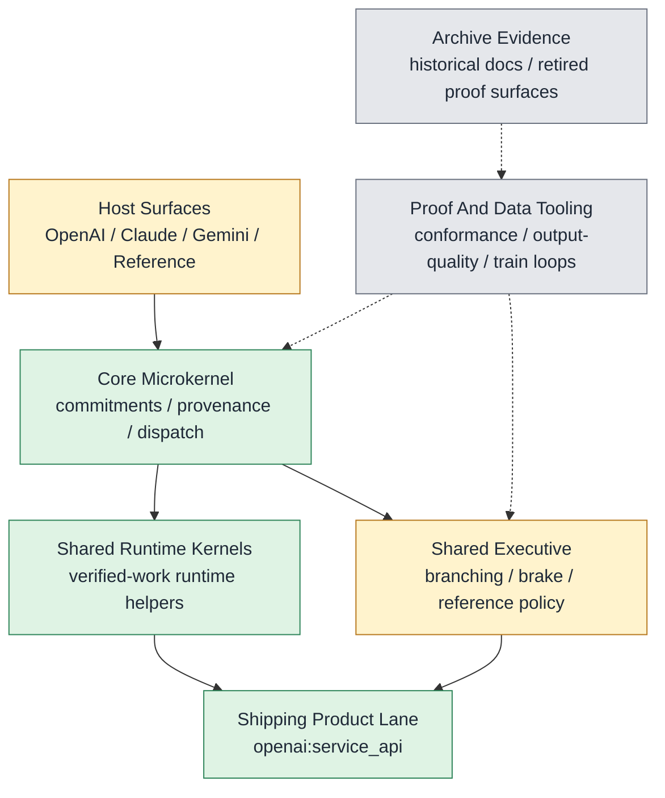

# CORTEX Status

Surface: product

_Generated from `internal/truth/cortex_status.json`. Edit the registry, then run `python3 internal/truth/generate_status.py`._

## Resting State

- Branch: `main`
- Rule: Clean synced main is the only resting state; the richer Cortex executive remains the product goal, and archive or lab surfaces do not define live product truth.

## Bootstrap

- `AGENTS.md`
- `docs/CORTEX_STATUS.md`
- `git branch --show-current`
- `git status --short --untracked-files=all`

## Goal

**Rich Executive For AI**

Cortex should be a richer multi-host executive layer for AI work: lifecycle-first, verification-aware, continuity-preserving, and capable of bounded correction without collapsing into host-specific hacks.

Not product:
- `diagnostics`
- `train loops`
- `graders`
- `workflow ledgers`
- `governance records`

## System Map

## Subsystems

| Subsystem | Status | Code Homes | Note |
| --- | --- | --- | --- |
| Core Microkernel | `green` | `cortex/core`, `cortex/drivers` | Active product law for commitments, provenance, dispatch, and host binding. |
| Shared Runtime Kernels | `green` | `cortex/runtime` | Only shared runtime kernels belong here. |
| Shared Executive | `yellow` | `cortex/sre` | Richer shared executive is active Cortex code; mediation remains experimental/off-by-default even though it lives beside the active SRE family. |
| Host Realizations | `yellow` | `cortex/hosts/openai`, `cortex/hosts/claude`, `cortex/hosts/gemini`, `cortex/hosts/reference` | Host-native shells are part of Cortex reality; shipping truth stays OpenAI-first while Claude, Gemini, and reference remain explicit conformance surfaces. |
| Proof And Data Tooling | `gray` | `lab`, `lab/eval`, `tools` | Proof, evaluation, and maintainer tooling. Useful for falsification, not product truth. |

## Packet To Code

| Packet | Responsibility | Code Homes | Proof Surfaces |
| --- | --- | --- | --- |
| `Core` | Lifecycle-first dispatch, commitment extraction, provenance, certification, and bounded environment access. | `cortex/core`, `cortex/drivers` | `tests/product`, `tests/conformance` |
| `SRE` | Reference control policy, branching, brake, uncertainty, verified-work preservation, and reference scoring. | `cortex/sre` | `tests/product`, `tests/experimental` |
| `Host Wiring` | Host-native runtime shells and transport/service bindings for OpenAI, Claude, Gemini, and reference. | `cortex/hosts/openai`, `cortex/hosts/claude`, `cortex/hosts/gemini`, `cortex/hosts/reference` | `tests/product`, `tests/conformance` |
| `Lab Proof` | Conformance runners, output-quality tooling, and train-loop evidence used to falsify or prove product seams. | `lab`, `lab/eval` | `tests/lab`, `tests/internal` |

## Hosts

| Host | Shipping | Conformance | Strongest Surface | Daily Iteration | Code Home |
| --- | --- | --- | --- | --- | --- |
| `openai` | `default` | `conformant` | `service_api` | `operator_cli` | `cortex/hosts/openai` |
| `claude` | `non-default` | `partial` | `operator_cli` | `operator_cli` | `cortex/hosts/claude` |
| `gemini` | `non-default` | `partial` | `operator_cli` | `operator_cli` | `cortex/hosts/gemini` |
| `reference` | `non-product` | `conformant` | `reference_cli` | `reference_cli` | `cortex/hosts/reference` |

## Shipping And Conformance Truth

- Shipping default: `openai:service_api`
- Accepted conformance next decision: `promote`

## Closure Gates

| Gate | Status | Note |
| --- | --- | --- |
| `main_synced` | `passed` | Resting truth is enforced through clean synced main and the workflow helper. |
| `cleanup_report` | `passed` | cleanup-report is the strict final hygiene gate for the resting repo state. |
| `single_truth` | `passed` | The status registry and generated status doc are the only live operational truth surfaces. |
| `legacy_test_buckets_removed` | `passed` | tests/unit and tests/integration are retired in favor of purpose-first active buckets. |

## Next Product Train

- Train: `e23-kernel-extract`
- Surface: `product`
- Executive benefit: Port only the preservation-state product kernel from the preserved evidence ref onto clean main so verified-work repair law becomes a maintained Cortex capability without dragging maintainer-only trains into product truth.
- Why now: The repo closeout removes truth drift and repo-hygiene noise so the next runtime hour can go straight into a real product kernel.
- Primary metric: `repair-conversion improvement on the bounded OpenAI verified-work repair bundle`
- Guardrail: `thin OpenAI path unchanged when no work contract is present`
- Kill rule: `cut after 2 non-lift revisions or no clearer divergence classification`

## Where To Work Next

- Start with the E23 preservation-state kernel extract on the bounded OpenAI verified-work repair bundle.
- Keep tri-brain conformance explicit while shipping truth stays OpenAI-first.
- Use lab proof surfaces only to falsify or prove product seams; do not reopen broad replay/watch trains without a direct product reason.

## Canonical Proof

**Default**

- `make product-test`
- `make conformance-test`
- `make experimental-test`
- `make -C internal test`
- `make lab-test`

**Status**

- `python3 internal/truth/generate_status.py --check`
- `python3 internal/archive/generate_archive_index.py --check`

**Workflow**

- `python3 internal/workflow/repo_workflow.py sync-main`
- `python3 internal/workflow/repo_workflow.py start-session --agent codex --slug task-name`
- `python3 internal/workflow/repo_workflow.py close-session --message "scope: end-state summary"`
- `python3 internal/workflow/repo_workflow.py cleanup-report`

## Retained Data

- `conformance` at `.cortex/live_validation/conformance` keeps `accepted_baseline`, `current_candidate`, `latest`
  Policy: Timestamped runs are generated evidence only; manifests and summaries outrank raw timestamp directories.
- `train_loops` at `.cortex/train_loops` keeps `accepted_baseline`, `current_candidate`, `latest`
  Policy: Compact summaries are the maintained view; old train narratives are archival.

## Retained Evidence Refs

- `E23 preservation-state evidence` -> `archive/e23-preservation-state-machine`
  Purpose: Preserved review evidence for the next product-kernel extraction train.

## Blocked Moves

- Do not let archived docs or train notes act as live truth.
- Do not treat lab or evaluation output as product progress unless shipped runtime behavior changes.
- Do not hide Claude or Gemini behind backlog language when reporting conformance.
- Do not reopen broad watch or replay trains until the product kernel extract is classified.

## Active Docs

- `docs/README.md`
- `docs/CORTEX_PRODUCT_CHARTER.md`
- `docs/CORTEX_PRODUCT_BOUNDARY.md`
- `docs/CORTEX_V2_CORE_2.md`
- `docs/CORTEX_V2_SRE_2.md`
- `docs/CORTEX_V2_AUX_2.md`
- `docs/CORTEX_STATUS.md`
- `docs/internal/REPO_WORKFLOW.md`

## Operational Focus

- Current tracked train: `e23-kernel-extract`
- Current focus note: Start from the preserved E23 evidence ref and port only the preservation-state product kernel onto clean main without reviving maintainer-only replay or allocator trains.
